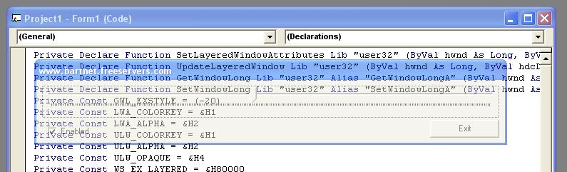



## Transparrency Example

### Description

A simple example of how to make a form transparrent. Use the slider to select the transparrency level. (only workes on nt-based operating systems.)
 
### More Info
 

             |
---                |---
**Submitted On**   |2002-11-19 15:51:04
**By**             |[BelgiumBoy\_007](https://github.com/Planet-Source-Code/PSCIndex/blob/master/ByAuthor/belgiumboy-007.md)
**Level**          |Intermediate
**User Rating**    |5.0 (10 globes from 2 users)
**Compatibility**  |VB 6\.0
**Category**       |[Miscellaneous](https://github.com/Planet-Source-Code/PSCIndex/blob/master/ByCategory/miscellaneous__1-1.md)
**World**          |[Visual Basic](https://github.com/Planet-Source-Code/PSCIndex/blob/master/ByWorld/visual-basic.md)
**Archive File**   |[Transparre15002311192002\.zip](https://github.com/Planet-Source-Code/belgiumboy-007-transparrency-example__1-40886/archive/master.zip)

